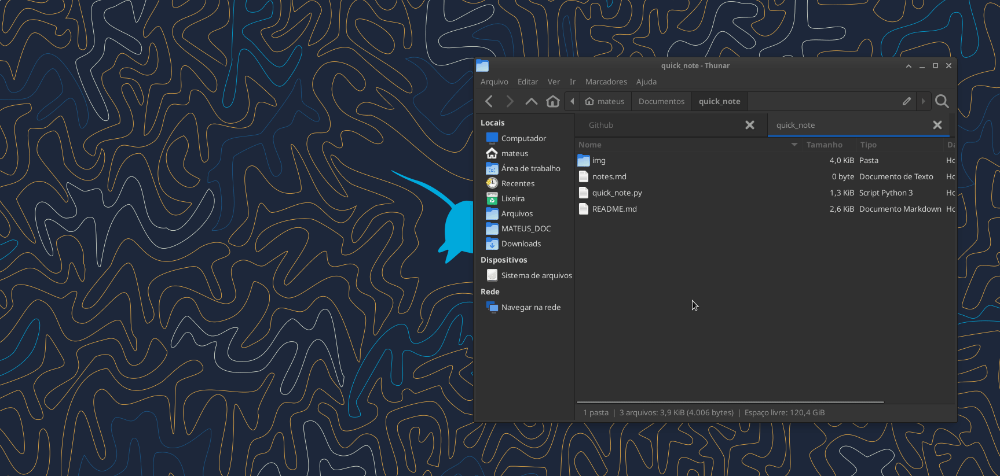

# Quick Notes

[](https://opensource.org/licenses/MIT)

## Overview

Quick Notes is a simple note-taking application designed to help individuals with ADHD (Attention-Deficit/Hyperactivity Disorder) stay focused and organized. The idea is to provide a quick and straightforward way to jot down notes during your tasks without distracting you with unnecessary features. This Python script creates a minimalistic GUI window where you can enter your notes using a predefined keybinding. The notes are automatically saved with the date and time in a designated file.

## Key Features

- Simple and distraction-free note-taking interface
- Automatic date and time stamp for each note
- Customizable keybinding to open the note-taking window
- Easy integration with Linux desktop environments and other note taking applications, if your note files are saved on the computer. 

Below I show how to use it on my Debian Linux system with XFCE. I set the key combination Win+n to run the script and <Return> to save the note to file. The file I use is saved in my [Obsidian](https://obsidian.md/) vault folder. Which makes it easier to view my notes in markdown and organize them.


## Getting Started

### Prerequisites

- Python 3.x installed on your system
- Tkinter van be installed using pip

### Setup

1. Clone this repository to your local machine or download the [script](./quick_notes.py) directly.
2. Ensure you have execution permission for the script:

   ```bash
   chmod +x quick_notes.py
   ```

### Usage

1. Define a keybinding (e.g., Win+n) on your XFCE desktop to execute the `quick_notes.py` script.
2. Press the defined keybinding to open the Quick Notes window.
3. Start typing your note in the text box provided.
4. Press `Return` to save the note with the current date and time.
5. The note will be appended to the `notes.md` file in your `Documents` folder.

> If you want to change the file where the notes will be saved just change the full path of location and file name to your preference: 

```Python3
# set the file location
full_path = "your/new/folder/"
note_file = full_path + "new_file.txt"
```

### Example in the terminal

You can run the `quick_notes.py` in the terminal just calling `./quick_note.py`. Don't forget to give execute permission and change your directory as explained above.

The Quick Notes window will appear and you can type the note that you want. ex: 

`This is a sample note. I need to focus on my current task and avoid distractions.`

Upon pressing `Return`, the note will be saved in `notes.md` with a timestamp:

`**Thursday - 07/21/2023 - 14:30:15**: This is a sample note. I need to focus on my current task and avoid distractions.`



## Customization

You can customize the following aspects of the Quick Notes application:

- **Keybinding:**  Modify the keybinding by changing the binding in your XFCE desktop settings to execute the `quick_notes.py` script.

## License

This project is licensed under the MIT License - see the [LICENSE](https://opensource.org/license/mit/) file for details.

---

I hope this simple script will help you deal with ADHD as it has helped me. 📝
